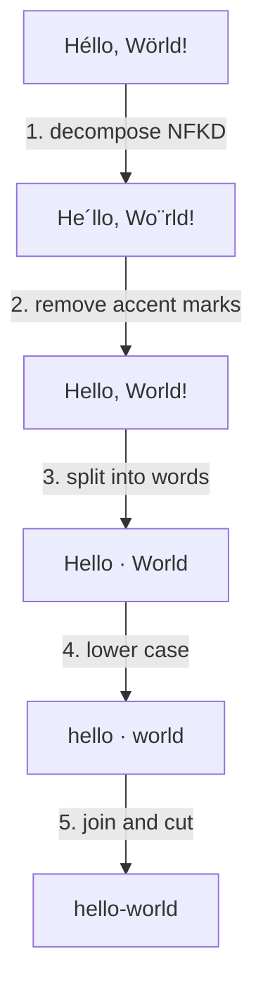

`slugify` runs the same five steps on every input. Knowing them helps you predict any result.

<Steps>
  <Step title="Decompose">
    The text is normalized to Unicode form NFKD. A letter with an accent splits into the base letter and a separate
    accent mark (`é` → `e` + `´`), and compatibility characters become their plain form (`fi` → `fi`).
  </Step>
  <Step title="Remove accent marks">
    Every combining mark (Unicode category `M`) goes away. Only the base letters stay.
  </Step>
  <Step title="Split into words">
    Each run of characters that is not a letter (`L`) or a digit (`N`) is a word break. Spaces, punctuation, symbols,
    and emoji all count as breaks.
  </Step>
  <Step title="Lower case">Each word becomes lower case, unless you set `lowercase: false`.</Step>
  <Step title="Join and cut">
    The words join with the separator. With `maxLength`, the slug is cut without a separator at the end and without a
    broken character.
  </Step>
</Steps>

## Examples

| Input              | Slug               | Why                                             |
| ------------------ | ------------------ | ----------------------------------------------- |
| `Crème brûlée`     | `creme-brulee`     | Accents are removed.                            |
| `Ångström`         | `angstrom`         | `Å` decomposes to `A` and a ring mark.          |
| `file ½`            | `file-1-2`         | NFKD turns the ligature and the fraction plain. |
| `user@example.com` | `user-example-com` | `@` and `.` are word breaks.                    |
| `v1.2.3`           | `v1-2-3`           | Digits are words too.                           |
| `I ❤️ TypeScript`  | `i-typescript`     | Emoji are not letters, so they are breaks.      |
| `C# & F#`          | `c-f`              | Symbols are breaks.                             |
| `---`              | (empty string)     | No letters or digits are left.                  |

## Other scripts

`slugify` does not transliterate. Letters from every script stay as they are, in lower case:

| Input         | Slug          |
| ------------- | ------------- |
| `Привет мир`  | `привет-мир`  |
| `東京 タワー` | `東京-タワー` |
| `Straße`      | `straße`      |

Browsers show these slugs as you write them, and send them percent-encoded. If a system accepts only ASCII, call `encodeURIComponent` on the slug, or transliterate the text before you call `slugify`.

:::warning
Two different texts can give the same slug, for example `Crème` and `Creme`. If slugs must be unique, check for collisions.{/* kit:library */} The [library guide](/guides/library#recipes) has a recipe for that.{/* /kit:library */}
:::
